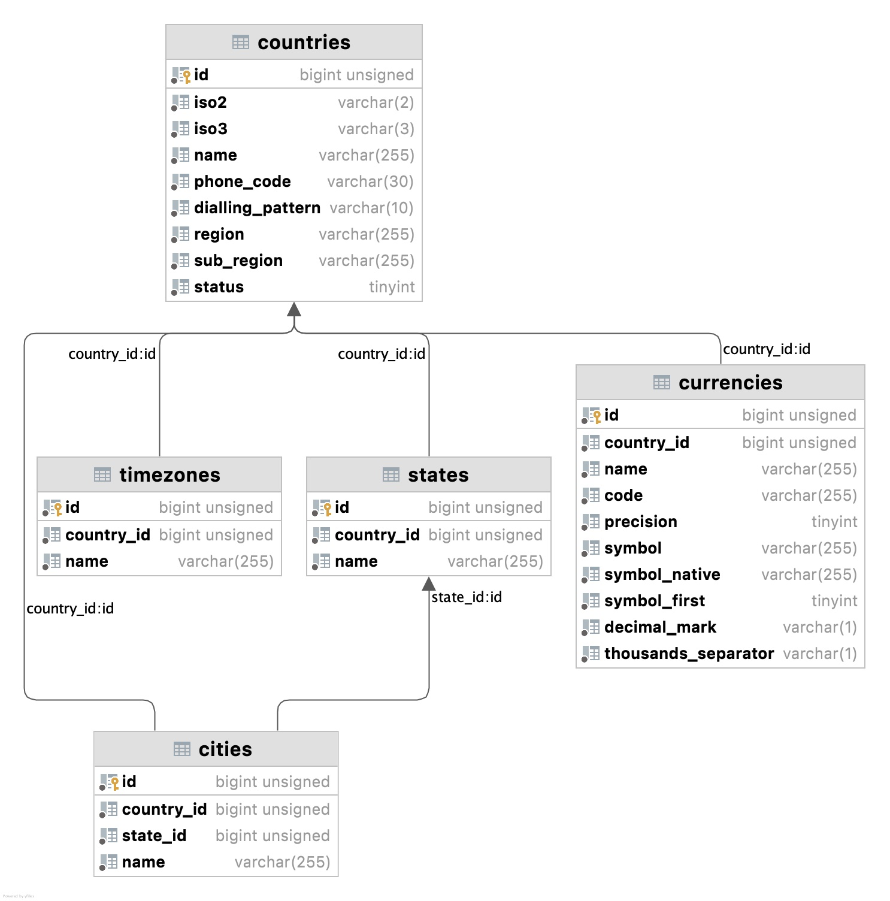

<p style="text-align: center; padding: 3rem;"></p>

The World is a Laravel package which provides a list of the countries, states, cities, timezones, currencies and languages.

It can be consumed with the World Facade or the defined Api routes.

### Installation

```
composer require nnjeim/world

php artisan vendor:publish --tag=world

php artisan migrate

php artisan db:seed --class=WorldSeeder (requires ~15min)
```

### What's new in v1.1.17?
- Simplification of the response trait.
- Rework of the actions reponses.

### Changelog

Please read [CHANGELOG](CHANGELOG.md) for more information of what was changed recently. 

### Contributing

Please read [CONTRIBUTING](CONTRIBUTING.md) for more details.

### Demo
Please feel free to query https://laravel-world.com 
  
Examples  
https://laravel-world.com/api/countries  
https://laravel-world.com/api/countries?search=rom  
https://laravel-world.com/api/states?filters[country_code]=RO&fields=cities  

### Usage

#### List all the countries.

Use the World facade  

``` 
use Nnjeim\World\World;

$action =  World::countries();

if ($action->success) {
  $countries = $action->data;
}

response (object)
{
  "success": true,
  "data": [
    {
      "id": 1,
      "name": "Afghanistan"
    },
    {
      "id": 2,
      "name": "Åland Islands"
    },
    .
    .
    .
  ],
}
``` 

Use the Api countries endpoint
```
https://myDomain.local/api/countries
```

#### Fetch a country with its states and cities.

Use the World facade  

``` 
use Nnjeim\World\World;

$action =  World::countries([
	'fields' => 'states,cities',
	'filters' => [
		'iso2' => 'FR',
	]
]);

if ($action->success) {

	$countries = $action->data;
}

response (object)
{
  "success": true,
  "data": [
    "id": 77,
    "name": "France",
    "states": [
        {
          "id": 1271,
          "name": "Alo"
        },
        {
          "id": 1272,
          "name": "Alsace"
        },
        .
        .
        .
    ],
    "cities": [
        {
          "id": 25148,
          "name": "Abondance"
        },
        {
          "id": 25149,
          "name": "Abrest"
        },
        .
        .
        .
      ]
    ],
}
```

Use the Api countries endpoint
```
https://myDomain.local/api/countries?fields=states,cities&filters[iso2]=FR
```

#### List all the cities by country id.

``` 
use Nnjeim\World\WorldHelper;

protected $world;

public function __construct(WorldHelper $world) {

	$this->world = $world;
}

$action = $this->world->cities([
	'filters' => [
		'country_id' => 182,
	],
]);

if ($action->success) {

	$cities = $action->data;
}
```

Use the Api cities endpoint
```
https://myDomain.local/api/cities?filters[country_code]=RO 
```

### Available actions

| Name       | Description                   |
|:-----------|:------------------------------|
| countries  | lists all the world countries |
| states     | lists all the states          |
| cities     | lists all the cities          |
| timezones  | lists all the timezones       |
| currencies | lists all the currencies      |
| languages  | lists all the languages       |

An action response is formed as below:

* success (boolean)
* message (string)
* data (instance of Illuminate\Support\Collection)
* errors (array)

#### Countries action

* fields*: comma seperated string(countries table fields in addition to states, cities, currency and timezones).
* filters*: array of keys(countries table fields) and their corresponding values.
* search*: string.  

#### States action

* fields*: comma seperated string(states table fields in addition to country and states).
* filters*: array of keys(states table fields) and their corresponding values.
* search*: string.  

#### Cities action

* fields*: comma seperated string(cities table fields in addition to country and state).
* filters*: array of keys(cities table fields) and their corresponding values.
* search*: string.  

#### Timezones action

* fields*: comma seperated string(timezones table fields in addition to country).
* filters*: array of keys(timezones table fields) and their corresponding values.
* search*: string.  

#### Currencies action

* fields*: comma seperated string(currencies table fields in addition to country).
* filters*: array of keys(currencies table fields) and their corresponding values.
* search*: string.  

#### Languages action

* fields*: comma seperated string(languages table fields).
* filters*: array of keys(languages table fields) and their corresponding values.
* search*: string.  

### Available Api routes

All routes can be prefixed by any string. Ex admin, api, api ...

#### Countries

| |                                                                                                                                    |
| :--- |:-----------------------------------------------------------------------------------------------------------------------------------|
| Method | GET                                                                                                                                |
| Route | /{prefix}/countries                                                                                                                |
| Parameters* | comma seperated fields(countries table fields in addition to states, cities, currency and timezones), array filters, string search |
| Example | /api/countries?fields=iso2,cities&filters[phone_code]=44                                                                           |   
| response | success, message, data                                                                                                             |  

#### States

| | |
| :--- | :--- |
| Method | GET |
| Route | /{prefix}/states |
| Parameters* | comma seperated fields(states table fields in addition to country and cities), array filters, string search |
| Example | /api/states?fields=country,cities&filters[country_code]=RO  |   
| response | success, message, data |   

#### Cities

| |                                                                                             |
| :--- |:--------------------------------------------------------------------------------------------|
| Method | GET                                                                                         |
| Route | /{prefix}/cities                                                                            |
| Parameters* | comma seperated fields(states table fields in addition to country and state), array filters, string search |
| Example | /api/cities?fields=country,state&filters[country_code]=RO                                   |   
| response | success, message, data                                                                      | 

#### Timezones

| |                                                                                       |
| :--- |:--------------------------------------------------------------------------------------|
| Method | GET                                                                                   |
| Route | /{prefix}/timezones                                                                   |
| Parameters* | comma seperated fields(states table fields in addition to the country), array filters, string search |
| Example | /api/timezones?fields=country&filters[country_code]=RO                                |   
| response | success, message, data                                                                | 

#### Currencies

| |                                                                                       |
| :--- |:--------------------------------------------------------------------------------------|
| Method | GET                                                                                   |
| Route | /{prefix}/currencies                                                                  |
| Parameters* | comma seperated fields(states table fields in addition to the country), array filters, string search |
| Example | /api/timezones?fields=country&filters[country_code]=RO                                   |   
| response | success, message, data                                                                |

#### Languages

| |                          |
| :--- |:-------------------------|
| Method | GET                      |
| Route | /{prefix}/languages      |
| Parameters* | comma seperated fields, string search   
| Example | /api/languages?fields=dir |   
| response | success, message, data   |

### Localization

The available locales are ar, bn, br, de, en, es, fr, it, ja, kr, nl, pl, pt, ro, ru, tr and zh.  
The default locale is en.  
Include in the request header

```
accept-language=locale
```
Alternativley, you can use specific locale with the `World` Facade `setLocale('locale')` helper method. Example:  
```
World::setLocale('zh')->countries();
```

### Schema

<p></p>

### Configuration  
The configuration of the world package is in the world.php config file.  
If you are upgrading from a previous version, you should consider re-publishing the file by issuing:  
```
php artisan vendor:publish --tag=world --force
```

### Countries restrictitions
Countries can be restricted while seeding the database either by adding the iso2 country codes in the allowed_countries or dissallowed_countries array lists.  

#### Supported Locales  
A list of the accepted locales which relate to the localized lang files.

#### Modules enablement  
The states, cities, timezones, currencies and languages modules can be optionally disabled.    
Please note that the cities module depends on the states module.  

#### Routes  
If you don't wish to use the packages as an api service, you can disable all the routes by assigning false to routes.  

#### Migrations  
It offers the ability to enable or disable the database fields.  
When changing this configuration the database should be dropped and the seeder should be re-run.  

### Testing  

Requirements  
- The database is seeded.
- The database connection is defined in the .env file. 

Browse to the package root folder and run:

``` bash
composer install //installs the package dev dependencies
composer test
```

`* optional`
